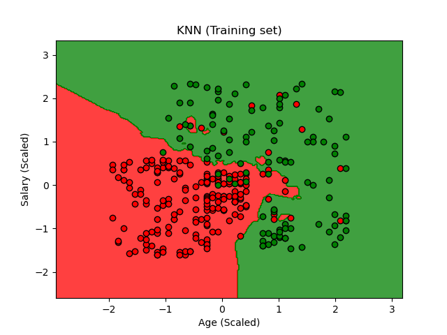
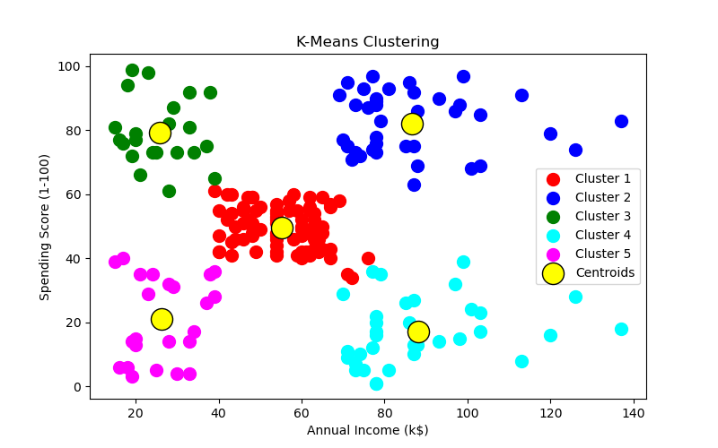

# Classic Machine Learning Algorithms: A Comparative Study


A modular implementation of fundamental supervised and unsupervised learning algorithms. This project benchmarks performance across **Regression**, **Classification**, and **Clustering** tasks using standard datasets to visualize decision boundaries and algorithmic behavior.

The goal is to provide a clean, "from-scratch" style reference for model selection and evaluation metrics without relying on AutoML abstractions.

## 📂 Project Structure

The repository is organized by learning task to maintain separation of concerns:

```text
├── data/                      # Raw CSV datasets
│   ├── Mall_Customers.csv     # Clustering target
│   ├── Salary_Data.csv        # Regression target
│   └── Social_Network_Ads.csv # Classification target
├── notebooks/                 # Jupyter notebooks for EDA and plotting
├── src/                       # Production-ready Python scripts
│   ├── classification.py      # Logistic, KNN, SVM, Naive Bayes, Trees
│   ├── clustering.py          # K-Means, Hierarchical Clustering
│   └── regression.py          # Linear, Polynomial, SVR, Random Forest
├── images/                    # Plots for documentation
└── requirements.txt           # Dependencies
```

## 📊 Performance Benchmarks

1. Classification (Social Network Ads)
Predicting if a user purchases a product based on Age and Estimated Salary.

|Comparative Results: | Model | Accuracy Score | Key Observation |
|--------------------|-------|----------------|-----------------|
 | 1. | K-NN | 93.0% | Captured non-linear boundaries best. |
 | 2. | Kernel SVM | 93.0% | Equivalent to K-NN but computationally heavier. |
 | 3. | Random Forest | 89.0% | Slight overfitting on training data. |
 | 4. | Logistic Regression | 86.0% | Underperformed due to linear constraint. |

> Note: K-NN and Kernel SVM proved most effective for this non-linearly separable dataset.

  

Figure 1: Decision boundaries showing how K-NN adapts to local clusters compared to Logistic Regression.

2. Regression (Salary Data)
Predicting employee salary based on years of experience.

| Model | R² Score | Usage Case |
|-------|----------|------------|
| Polynomial Reg| 0.98 | Best fit for the exponential growth curve |
| Linear Regression | 0.94 |"Good baseline, but missed upper-bracket variance." |
| Random Forest | 0.96 | Accurate but cannot extrapolate beyond training range. |

3. Clustering (Mall Customers)
Segmenting customers based on Annual Income and Spending Score to find target groups.
* Method: K-Means with Elbow Method to determine optimal $k$.
* Result: Identified 5 distinct customer personas (e.g., "High Income, Low Spenders" vs. "Target Group").


Figure 2: The 5 customer segments identified by K-Means.

## 🛠️ Tech Stack & Implementation Details
* **Language:** Python 3.8+
* **Libraries:**
  * `scikit-learn:` Core model implementation and metrics.
  * `pandas` & `numpy:` Data manipulation and vectorization.
  * `matplotlib` & `seaborn:` Visualization of decision regions and dendrograms.
 
## 🚀 Usage
1. Clone the repository
```bash
git clone [https://github.com/BlagojaBudzak/ml-model-comparison.git](https://github.com/BlagojaBudzak/ml-model-comparison.git)
```
2. Install dependencies
```bash
pip install -r requirements.txt
```
3. Run a specific module
```bash
# To view classification model comparisons
python src/classification_models.py

# To view clustering segmentation
python src/clustering_models.py
```

## 🏆Developed by Blagoja Budzakoski
